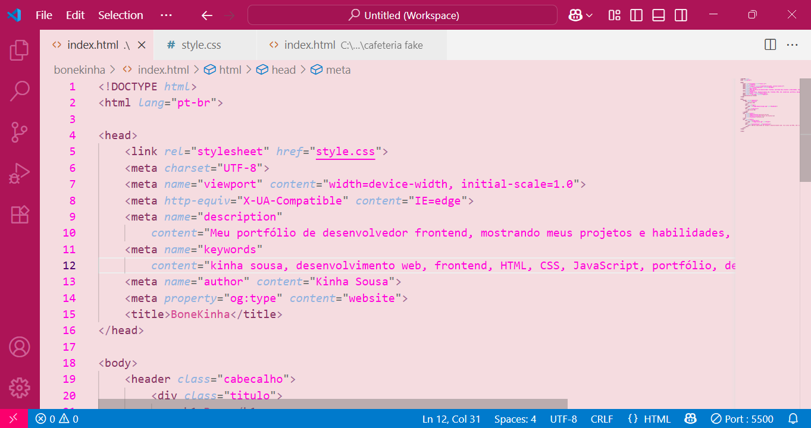
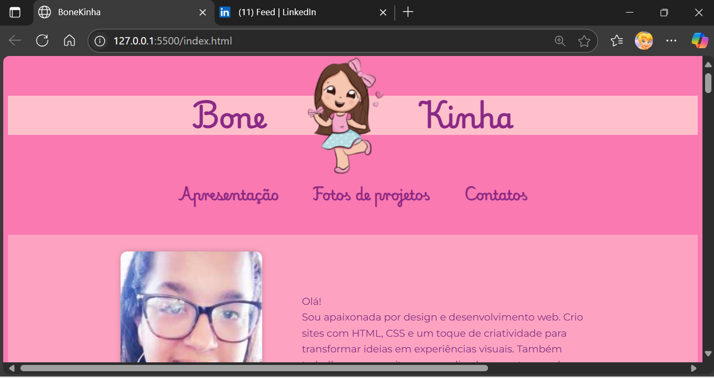

# 🌸 BoneKinha – Portfólio / Portfolio  

## 🇧🇷 Português  
Portfólio online criado com **HTML, CSS e JavaScript** para apresentar meus projetos de **design gráfico e frontend**.  

### ✨ Destaques  
- Galeria interativa de projetos  
- Formulário de contato (FormSubmit)  
- Botão fixo do WhatsApp  
- Layout responsivo  

---

## 🇺🇸 English  
Online portfolio built with **HTML, CSS, and JavaScript** to showcase my **graphic design and frontend** projects.  

### ✨ Highlights  
- Interactive project gallery  
- Contact form (FormSubmit)  
- Fixed WhatsApp button  
- Responsive layout  

### 📸 Demonstração  
  
  

🔗 **Acesse o site online:** [Clique aqui para visitar](https://kinha28.github.io/blog-bonekinha/)  

